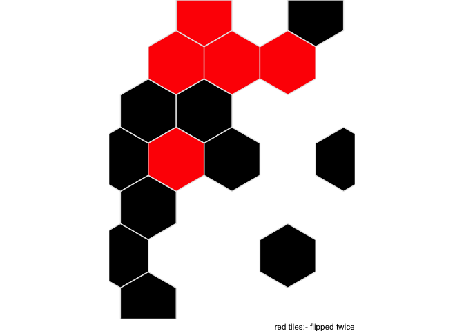

🎄🎄🎄 day 24 🎄🎄🎄
================

``` r
library(tidyverse)
library(here)
```

### Part 1

``` r
# hexagonal compass lookup table
r3 <- sqrt(3)
lkup <- tribble(~compass, ~x, ~y,
               "w", -1, 0,
               "e", +1, 0,
               "nw", -1/2, r3/2,
               "ne", +1/2, r3/2,
               "sw", -1/2, -r3/2,
               "se", +1/2, -r3/2
               ) %>% 
  mutate(num = 1:n())

# fn to transalte and collapse flips

collapse_flips <- function(flips){
  tibble(compass = flips[[1]]) %>% 
    left_join(lkup, by = "compass") %>% 
    summarise(x = sum(x), y = sum(y))
}
```

``` r
# do flips

tiles <- read_lines(here("day_24","test.txt")) %>%
  as_tibble() %>% 
  mutate(instruction = 1:n()) %>% 
  mutate(compass = map(value, str_extract_all, "(w|e|nw|ne|sw|se)")) %>% 
  mutate(collapse = map(compass, collapse_flips)) %>% 
  unnest(collapse) %>% 
  select(-compass) %>% 
  group_by(x, y) %>% 
  tally() %>% 
  ungroup()


tiles %>% 
  count(n)
```

    ## # A tibble: 2 x 2
    ##       n    nn
    ##   <int> <int>
    ## 1     1    10
    ## 2     2     5

``` r
ggplot(tiles) +
  aes(x, y, fill = factor(n)) +
  geom_hex(stat = "identity", colour = "grey90") +
  scale_fill_manual(values = c("black", "red")) +
  theme_void() +
  theme(legend.position = "none") +
  coord_equal() +
  labs(captions = "red tiles:- flipped twice")
```

<!-- -->

### Part 2

1.  Any black tile with zero or more than 2 black tiles immediately
    adjacent to it is flipped to white.
2.  Any white tile with exactly 2 black tiles immediately adjacent to it
    is flipped to black.

``` r
# just record black tiles
tiles <- tiles %>% 
  filter(n == 1)


count_neighbours <- function(x, y){
  tibble(x, y) %>% 
    crossing(lkup %>% rename(dx = x, dy = y)) %>% 
    mutate(nx = x + dx,
           ny = y + dy) %>% 
    left_join(tiles, by = c("nx" = "x", "ny" = "y")) %>% 
    summarise(total = sum(n, na.rm = TRUE)) %>% 
    pull(total)
}


for(ii in 1:100){
  print(ii)
  flush.console()
  tiles %>% 
  mutate(neighbours = map2_int(x, y, count_neighbours)) %>%
  mutate(n = case_when(n == 1 & neighbours == 0 ~ 2,
                       n == 1 & neighbours >  2 ~ 2,
                       n == 2 & neighbours == 2 ~ 1))
}
```

    ## [1] 1
    ## [1] 2
    ## [1] 3
    ## [1] 4
    ## [1] 5
    ## [1] 6
    ## [1] 7
    ## [1] 8
    ## [1] 9
    ## [1] 10
    ## [1] 11
    ## [1] 12
    ## [1] 13
    ## [1] 14
    ## [1] 15
    ## [1] 16
    ## [1] 17
    ## [1] 18
    ## [1] 19
    ## [1] 20
    ## [1] 21
    ## [1] 22
    ## [1] 23
    ## [1] 24
    ## [1] 25
    ## [1] 26
    ## [1] 27
    ## [1] 28
    ## [1] 29
    ## [1] 30
    ## [1] 31
    ## [1] 32
    ## [1] 33
    ## [1] 34
    ## [1] 35
    ## [1] 36
    ## [1] 37
    ## [1] 38
    ## [1] 39
    ## [1] 40
    ## [1] 41
    ## [1] 42
    ## [1] 43
    ## [1] 44
    ## [1] 45
    ## [1] 46
    ## [1] 47
    ## [1] 48
    ## [1] 49
    ## [1] 50
    ## [1] 51
    ## [1] 52
    ## [1] 53
    ## [1] 54
    ## [1] 55
    ## [1] 56
    ## [1] 57
    ## [1] 58
    ## [1] 59
    ## [1] 60
    ## [1] 61
    ## [1] 62
    ## [1] 63
    ## [1] 64
    ## [1] 65
    ## [1] 66
    ## [1] 67
    ## [1] 68
    ## [1] 69
    ## [1] 70
    ## [1] 71
    ## [1] 72
    ## [1] 73
    ## [1] 74
    ## [1] 75
    ## [1] 76
    ## [1] 77
    ## [1] 78
    ## [1] 79
    ## [1] 80
    ## [1] 81
    ## [1] 82
    ## [1] 83
    ## [1] 84
    ## [1] 85
    ## [1] 86
    ## [1] 87
    ## [1] 88
    ## [1] 89
    ## [1] 90
    ## [1] 91
    ## [1] 92
    ## [1] 93
    ## [1] 94
    ## [1] 95
    ## [1] 96
    ## [1] 97
    ## [1] 98
    ## [1] 99
    ## [1] 100
