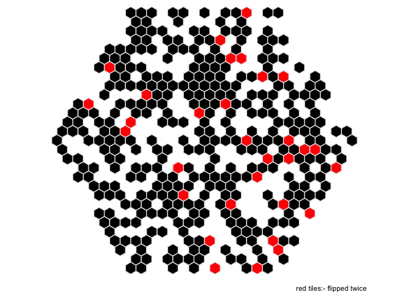

🎄🎄🎄 day 24 🎄🎄🎄
================

``` r
library(tidyverse)
library(here)
```

### Part 1

``` r
# hexagonal compass lookup table
r3 <- sqrt(3)
lkup <- tribble(~compass, ~x, ~y,
               "w", -1, 0,
               "e", +1, 0,
               "nw", -1/2, r3/2,
               "ne", +1/2, r3/2,
               "sw", -1/2, -r3/2,
               "se", +1/2, -r3/2
               ) %>% 
  mutate(num = 1:n())

# fn to transalte and collapse flips

collapse_flips <- function(flips){
  tibble(compass = flips[[1]]) %>% 
    left_join(lkup, by = "compass") %>% 
    summarise(x = sum(x), y = sum(y))
}

# do flips

tiles <- read_lines(here("day_24","input.txt")) %>%
  as_tibble() %>% 
  mutate(instruction = 1:n()) %>% 
  mutate(compass = map(value, str_extract_all, "(w|e|nw|ne|sw|se)")) %>% 
  mutate(collapse = map(compass, collapse_flips)) %>% 
  unnest(collapse) %>% 
  select(-compass) %>% 
  group_by(x, y) %>% 
  tally()


tiles %>% 
  ungroup() %>% 
  count(n)
```

    ## # A tibble: 2 x 2
    ##       n    nn
    ##   <int> <int>
    ## 1     1   346
    ## 2     2    31

``` r
ggplot(tiles) +
  aes(x, y, fill = factor(n)) +
  geom_hex(stat = "identity", colour = "white") +
  scale_fill_manual(values = c("black", "red")) +
  theme_void() +
  theme(legend.position = "none") +
  coord_equal() +
  labs(captions = "red tiles:- flipped twice")
```

<!-- -->

### Part 2
